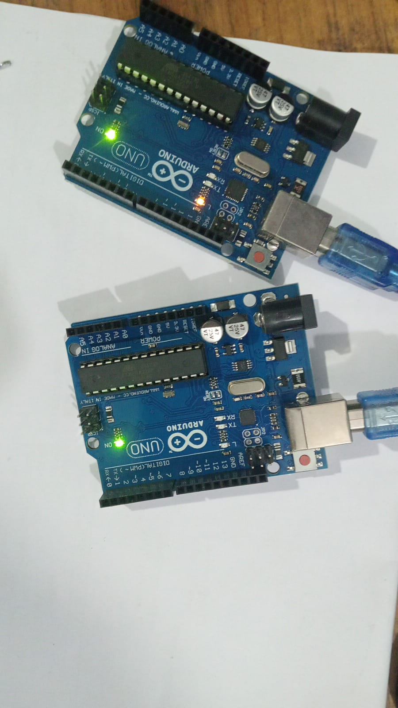
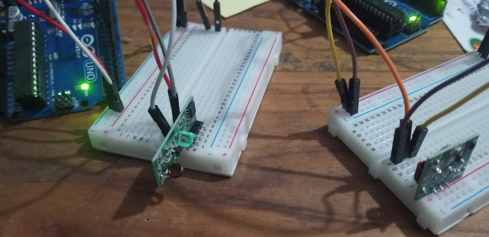
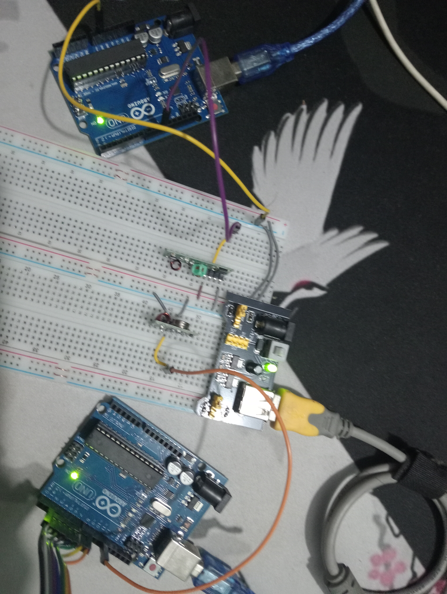

# LOG
- `Mon Feb 02 2026 07:35:20` : Project inception
- `Mon Feb 02 2026 07:44:20` : `OmniNav` naming
- `Mon Feb 02 2026 07:52:20` : Set constraints as
- - Lightweight
  - Comfortable
  - Easy to calibrate
  - Uses the bare minimum of human senses. (Currently, only the sensation of touch surrounding the forehead)
  - Intuitive/Easy to get used to.
  - Be as standalone as possible (Emergency contact requires internet and connectivity)
  - Doesn’t make the user stand out.
  - Easy to replicate/mass produce
- `Mon Feb 02 2026 07:55:20` : Estimate rough budget around $6K-$7K. Budgetary breakdown: 
  - GPS Module : $1200
  - Microcontrollers: $1000 (includes a combination of an esp32, arduino nano, pico)
  - Bluetooth modules: $300-$600
  - Ultrasonic sensors: $400
  - OPTIONAL GSM: $700
  - Vibration motors: $400
- `Mon Feb 02 2026 11:04:51` : Present proposal, pushback about headwear. budget set at $6500
- `Wed Feb 04 2026 06:26:03` : Decide on RF 433mhz on being the way the two parts communicate, instead of bluetooth
- `Wed Feb 04 2026 21:26:03` : Plan either two ATMega328s or one ATMega328 and one ATTiny85 for the headband (needs a DEMUX to handle 8 vibration motors)
- `Thu Feb 05 2026 13:40:16` : Make purchase

|Item No|Item Name|Price per unit|Quantity|Total|Store|Receipt|Note|
|:---:|:---:|:---:|:---:|:---:|:---:|:---:|:---:|
|1|Arduino Uno R3|550|2|1100|Swadesh [Attachment_1](attachments/1.png)| [Attachment_4](attachments/4.png)|Two atmega328s for communication|
|2|RF 433 receiver and transmitter pair|100|1|100|Swadesh [Attachment_1](attachments/1.png)| [Attachment_4](attachments/4.png)|For communication between the two parts|
|3|1n4148|2|8|16|Swadesh [Attachment_1](attachments/1.png)| [Attachment_4](attachments/4.png)|to prevent backfeeding|
|4|2n2222|2.5|8|20|Swadesh [Attachment_1](attachments/1.png)| [Attachment_4](attachments/4.png)|for the vibration motor|
|5|HC SR 04|65|4|260|Swadesh [Attachment_1](attachments/1.png)| [Attachment_4](attachments/4.png)|Sonar sensors|
|6|4056|15|1|15|Swadesh [Attachment_1](attachments/1.png)| [Attachment_4](attachments/4.png)|Chargine module|
|7|MPU 6050|170|1|170|Swadesh [Attachment_1](attachments/1.png)| [Attachment_4](attachments/4.png)|Gyroscope sensor|
|8|Neo-6m|330|1|330|Swadesh [Attachment_1](attachments/1.png)| [Attachment_4](attachments/4.png)|GPS Module|
|9|3.7 1000Mhz LiPo|140|1|140|AbdusSalam [Attachment_2](attachments/5.png)| [Attachment_5](attachments/5.png)|Battery for headgear|
|10|28 pin IC holder|10|2|20|AbdusSalam [Attachment_2](attachments/5.png)| [Attachment_5](attachments/5.png)|For arduino chips|
|11|Coin vibration motors|75|4|300|Mannan [Attachment_3](attachments/2.png)|❌|Haptic feedback; Need 4 more|
||Total||33|2471||||

- `Thu Feb 05 2026 16:03:20` : Started Logging 
- `Thu Feb 05 2026 18:55:20` : Blink Test passed for both UNOs


> lackluster entry made to be exemplary of how future entries go. (I need two UNOs because i'll be coding two simultaneously and will be testing to see them communicate), otherwise I'd just use one UNO to program different ATMega328s
- `Thu Feb 05 2026 19:35:10` : Bootload to every ATMega328 chip. 
`Thu Feb 05 2026 20:18:01` : Successfully established connection between two UNOs using RF [Commit](https://github.com/hamzahossain/OmniNav/commit/4007010bf32ae897c1e7cfd6a1b7ddbcb73898d0)


- `Thu Feb 05 2026 20:25:01` : To Make the atmega run standalone, i require
  - 16Mhz crystal oscillator
  - 22 pF ceramic capacitor (2)
  - 10 kOhm
  - 0.1 µF (3)
- `Thu Feb 05 2026 20:25:01` : For better RF performance, I need antennas `RF - 433MHz Helical Spring Antenna for Wireless Modules 2`
- `Fri Feb 06 2026 16:16:33` : The RF receiver has to have the ground connected to the chip's ground for some reason.
- `Fri Feb 06 2026 16:29:45` : Added keypad to transmitter to simulate dynamic directional input. [27dd4ac](https://github.com/hamzahossain/OmniNav/commit/27dd4ac302e5c6d990c6b570a41c689d82d74303)
- `Fri Feb 06 2026 18:35:45` : Made the workspace cleaner (combined the two breadboards. the RF works, there's no point in demonstrating that anymore). 

- `Fri Feb 06 2026 18:45:21` : Started coin vibration motor testing (PLAN: use the keypads to simulate test the intensities, 1-9 = 10%=90%) 
- `Fri Feb 06 2026 22:27:42` : SETBACK: Can't get Coin motors to work. 
- `Sat Feb 07 2026 18:48:17` : From simulation, I found that the problem is the PWM isn't giving enough voltage 
Addendum - I found the minimum (IN SIMULATION) value to be 120; learned something about a kickstarting value; Current plan: starting value will be the lowest feelable value (TO TEST), max value will be the most tolerable (accounting for hair) 
- `Sat Feb 07 2026 19:47:20` : FIXED Motor usage. **PROBLEM: RadioHead messes with pin 9 and 10 internally**
# Format
The time format is `GMT + 0600 (BST)`,\
$currency = `BDT`

# Log Scripts


```js
// generating timestamp script 
copy(`- \`${new Date().toString().split(' ').slice(0, 5).join(" ")}\` : `)
```
```js
// GENERATING INVOICE TABLE
//  "Item Name", "Price per unit", "Quantity", "Store", "Receipt", "Note"
/*
[
["Uno R3", "520", "2", "Swadesh a!1", "a!3", "Two atmega328s for communication"],
["RF 433 receiver and transmitter pair", "100", "1", "Swadesh a!1", "a!2", "For communication between the two parts"],
["1n4148", "2", '8', 'Swadesh a!1', 'a!3', 'to prevent backfeeding'],
["2n2222", "2.5", '8', 'Swadesh a!1', 'a!3', 'for the vibration motor'],
]
*/
function generateInvoicesTable(ar) {
    const categories = ["Item No", "Item Name", "Price per unit", "Quantity", "Total", "Store", "Receipt", "Note"];
    let totalPrice = 0;
    let totalQuan = 0;
    ar.forEach((a, i) => {
        a.unshift(i + 1);
        const paid = a[3] * a[2];
        a.splice(4, 0, paid);
        totalPrice += paid;
        totalQuan += +a[3];
        if (a.length != categories.length) throw new Error("Mismatch");
        if (a[6].includes("a!")) {
            const spl = a[6].split("a!");
            a[6] = `${spl[0].trim()} [Attachment_${spl[1]}](attachments/${spl[1]}.png)`;
        }
        if (a[5].includes("a!")) {
            const spl = a[5].split("a!");
            a[5] = `${spl[0].trim()} [Attachment_${spl[1]}](attachments/${spl[1]}.png)`;
        }
    });

    ar.unshift([]); // padding
    ar.unshift(categories);
    for (let i = 0; i < categories.length; i++) {
        ar[1].push(":---:"); // center
    }
    ar.push(Array.from({ lenghth: categories.length }).fill(""));
    ar.at(-1)[1] = "Total";
    ar.at(-1)[3] = totalQuan;
    ar.at(-1)[4] = totalPrice;
    let res = ``;
    for (let i = 0; i < ar.length; i++) {
        res += "|";
        for (let j = 0; j < ar[0].length; j++) {
            res += `${ar[i][j] ?? ""}|`;
        }
        res += "\n";
    }
    return res;
}
```
# ⚠️ DISCLAIMER

A few of the receipts weren't recoverable. 
The point of keeping the receipts is for budgetary accountability  
And the prices here are strictly what I have paid for them. These may change over time. The sources are linked but due to buying wholesale and haggling and at times being a regular customer, I got some of the components at a cheaper price. 
Some components I bought for my personal usage, which are just there in the receipts. they may be ignored.
Some components are bought to be extras. some may not be present at the final build. there will be a final component sheet with total build cost, independant from how much I spent on this project along the way.
